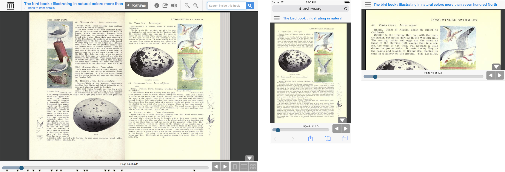

# Internet Archive BookReader



The Internet Archive BookReader is used to view books from the Internet Archive online and can also be used to view other books.

See live examples:
- On details page: https://archive.org/details/birdbookillustra00reedrich
- Full Screen: https://archive.org/stream/birdbookillustra00reedrich (mobile-friendly)


## Demos

See `BookReaderDemo` directory. These can be tested by starting a simple web server in the root directory. For example:

```
python -m SimpleHTTPServer
```
Or for Python 3:
```
python3 -m http.server
```

And then open `http://localhost:8000/BookReaderDemo/demo-simple.html`.


## Usage

Here is a short example.

```
// Create the BookReader object
var options = {
  data: [
    [
      { width: 800, height: 1200,
        uri: '//archive.org/download/BookReader/img/page001.jpg' },
    ],
    [
      { width: 800, height: 1200,
        uri: '//archive.org/download/BookReader/img/page002.jpg' },
      { width: 800, height: 1200,
        uri: '//archive.org/download/BookReader/img/page003.jpg' },
    ],
    [
      { width: 800, height: 1200,
        uri: '//archive.org/download/BookReader/img/page004.jpg' },
      { width: 800, height: 1200,
        uri: '//archive.org/download/BookReader/img/page005.jpg' },
    ]
  ],

  bookTitle: 'Simple BookReader Presentation',

  // thumbnail is optional, but it is used in the info dialog
  thumbnail: '//archive.org/download/BookReader/img/page014.jpg',

  // Metadata is optional, but it is used in the info dialog
  metadata: [
    {label: 'Title', value: 'Open Library BookReader Presentation'},
    {label: 'Author', value: 'Internet Archive'},
    {label: 'Demo Info', value: 'This demo shows how one could use BookReader with their own content.'},
  ],

  ui: 'full', // embed, full (responsive)

};
var br = new BookReader(options);

// Let's go!
br.init();

```

See `BookReaderDemo/demo-simple.html` and `BookReaderDemo/BookReaderJSSimple.js` for a full example. The best way to learn how to use BookReader is to view the source of the demos.

### Properties

- TODO (for now see BookReader.js and BookReader function at approx. line 44)


## Plugins

A basic plugin system is used. See the examples in the plugins directory. The general idea is that they are mixins that augment the BookReader prototype. See the plugins directory for all the included plugins, but here are some examples:

- plugins.chapters.js - render chapter markers
- plugins.search.js - add search ui, and callbacks
- plugins.tts.js - add tts (read aloud) ui, sound library, and callbacks
- plugins.url.js - automatically updates the browser url
- plugins.resume.js - uses cookies to remember the current page
- plugins.mobile_nav.js - adds responsive mobile nav to BookReader

## Embedding

BookReader can be embedded within an `<iframe>`. If you use the IFrame Plugin inside the `<iframe>`, the reader will send notifications about changes in the state of the reader via [`window.postMessage()`](https://developer.mozilla.org/en-US/docs/Web/API/Window/postMessage). The parent window can send messages of its own (also via `window.postMessage()`) and the IFrame Plugin will handle updating the reader to match.

### Message Events

#### Fragment Change
The Fragment Change message is sent to the parent window when the embedded BookReader moves between pages/modes. When the `<iframe>` receives this message, it moves to the specified page/mode. The “fragment” is formatted in accordance with the [BookReader URL spec](http://openlibrary.org/dev/docs/bookurls).

```json
{
  "type": "bookReaderFragmentChange",
  "fragment": "page/n1/mode/2up"
}
```

## Tests

Tests use [QUnit](https://qunitjs.com/). To run all tests, start up an HTTP server at the root of the project and navigate to `/tests/qunit.html` in a browser.

To add a new test, create a file in the `tests/` directory with the format `test-name-of-my-test.js` and add it as a `<script>` tag in `qunit.html`.

## More info

Developer documentation:
https://openlibrary.org/dev/docs/bookreader

Hosted source code:
https://github.com/internetarchive/bookreader

IIIF (http://iiif.io)
See `BookReaderDemo/demo-iiif.html` to see an example of how to load a IIIF manifest in BookReader.


## Notes about version 3

- Make BookReader easier to use, by adding `options` to the constructor, and adding new `options.data` option. The old way of overriding properties should still work, but it is deprecated.
- Factor out extra features into plugins. See `plugins` directory.
- Clean up code: Remove a lot of commented-out code. Remove some unused methods.
- Change some, but not all, CSS ids to classes.

See the CHANGELOG.md for more information.


## Notes about version 2

Some of the new features in version 2:
- Updated look for desktop
- Improved mobile support
- Fix issues with Text to Speech in browsers that don't support Flash
- Remove PHP backend code from this repository and only include frontend code


## Areas for improvement
- Change libraries to be NPM dependencies rather than included in the source code


## Contributing

Some notes for contributing:
- Please try to follow the code style within the file (spacing/comments/etc).
- Please only submit merge requests for features that would be useful for the general use
- Please try to avoid adding new libraries
- If the PR is a bug fix, include a link to a jsbin/codepen if possible
- Please test the changes in desktop, mobile, and embed modes, and also on many different devices/browsers.


## License

The source code license is AGPL v3, as described in the LICENSE file.

The mobile menu is built with [mmenu](http://mmenu.frebsite.nl/download.html), which is free for personal and non-profit use. However, for commmercial use, a license must be purchased.

To use it, include the script `plugins/plugin.mobile_nav.js`.


## Other credits

The ability to test on multiple devices is provided courtesy of [Browser Stack](https://www.browserstack.com).
